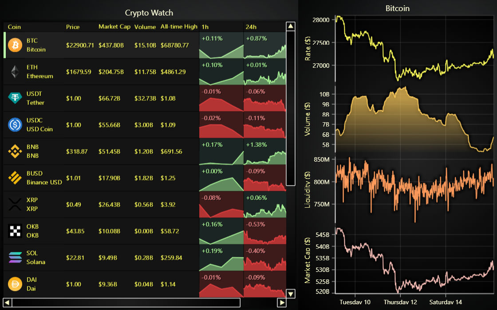

# JavaScript Data Grid Crypto Dashboard

This demo application belongs to the set of examples for LightningChart JS, data visualization library for JavaScript.

LightningChart JS is entirely GPU accelerated and performance optimized charting library for presenting massive amounts of data. It offers an easy way of creating sophisticated and interactive charts and adding them to your website or web application.

The demo can be used as an example or a seed project. Local execution requires the following steps:

-   Make sure that relevant version of [Node.js](https://nodejs.org/en/download/) is installed
-   Open the project folder in a terminal:

          npm install              # fetches dependencies
          npm start                # builds an application and starts the development server

-   The application is available at _http://localhost:8080_ in your browser, webpack-dev-server provides hot reload functionality.

## Description

Example showcasing LightningChart Data Grid in a cryptocurrency dashboard use case.

In this example, we can see a handful of the commonly used features of Data Grid:

-   Icons
    -   Currencies are identified with Icons.
-   Spark Charts
    -   A lot of data can be put into small spaces with these small miniature charts.
    -   In this case, for each currency the valuation history is displayed for the last hour, day and week.
-   Drill down
    -   Clicking on a Data Grid row changes the drill down view on the right.
-   Highlighting
    -   Actively focused row is highlighted.

Data Grid is a dynamic component, meaning that all its cell content can be changed at any point during runtime.
For example, this cryptocurrency dashboard could be updated every every couple seconds, displaying the latest changes in real-time.

To learn more of Data Grid, click [here](https://lightningchart.com/js-charts/datagrid/)

The data used in this example is from [Live coin watch](https://www.livecoinwatch.com/)

## API Links

* [Data Grid]
* [Chart XY]
* [Spark Chart]

## Support

If you notice an error in the example code, please open an issue on [GitHub][0] repository of the entire example.

Official [API documentation][1] can be found on [LightningChart][2] website.

If the docs and other materials do not solve your problem as well as implementation help is needed, ask on [StackOverflow][3] (tagged lightningchart).

If you think you found a bug in the LightningChart JavaScript library, please contact sales@lightningchart.com.

Direct developer email support can be purchased through a [Support Plan][4] or by contacting sales@lightningchart.com.

[0]: https://github.com/Arction/
[1]: https://lightningchart.com/lightningchart-js-api-documentation/
[2]: https://lightningchart.com
[3]: https://stackoverflow.com/questions/tagged/lightningchart
[4]: https://lightningchart.com/support-services/

© LightningChart Ltd 2009-2022. All rights reserved.

[Data Grid]: https://lightningchart.com/js-charts/api-documentation/v6.0.0/classes/DataGrid.html
[Chart XY]: https://lightningchart.com/js-charts/api-documentation/v6.0.0/classes/ChartXY.html
[Spark Chart]: https://lightningchart.com/js-charts/api-documentation/v6.0.0/types/SparkChart.html

